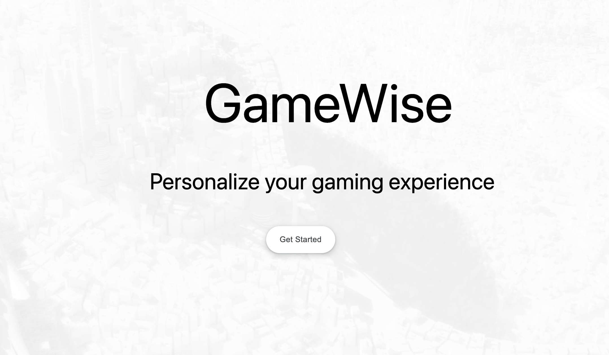

# GameWise 🎮

Welcome to GameWise, your personalized game recommendation engine powered by chatGPT. Discover new games based on your preferences and enjoy a tailored gaming experience.

## Table of Contents
- [Features](#features)
- [Installation](#installation)
- [Usage](#usage)
- [Screenshots](#screenshots)
- [Contributing](#contributing)
- [License](#license)

## Features

- **Personalized Recommendations:** GameWise utilizes chatGPT to recommend games based on your likes and dislikes.
- **User Interaction:** Engage in natural language conversations to refine your preferences.
- **Easy Integration:** Seamlessly integrate the recommendation engine into your gaming platform.

## Installation

To get started with GameWise, follow these steps:

1. Clone the repository:
   ```bash
   git clone https://github.com/your-username/GameWise.git

2. Install Dependencies 
```
npm install
```
3. Set up chatGPT API keys:
Obtain API keys from OpenAI (visit OpenAI API for access).
Add API keys to the configuration file.

4. Start the backend 
```
npm start
```

Usage

1) Start the GameWise application.
2) Engage in a conversation with the chat interface.
3) Provide information about games you like or dislike.
4) Receive personalized game recommendations. 

## Screenshots

